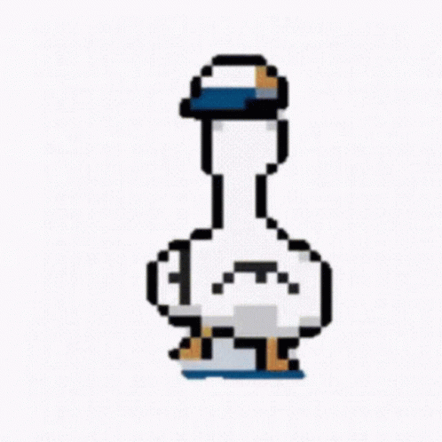

<link href="https://cdn.jsdelivr.net/npm/bootstrap@5.0.2/dist/css/bootstrap.min.css" rel="stylesheet" integrity="sha384-EVSTQN3/azprG1Anm3QDgpJLIm9Nao0Yz1ztcQTwFspd3yD65VohhpuuCOmLASjC" crossorigin="anonymous">

    

        

            <h4>Dancingdevs (DD) 
                <small class="text-muted" style="">
                    Paixão por dança e software. Soluções criativas e inovadoras.
                </small>
            </h4>
        

    

    

        
            
        
        

                <h4>Quem somos</h4>
                

                        &nbsp;&nbsp;&nbsp;&nbsp;&nbsp;&nbsp;&nbsp;                      
                        Olá, somos a dancingdevs, uma startup de desenvolvimento de software que combina paixão, criatividade 
                    e inovação. Nós amamos criar soluções tecnológicas que atendam às necessidades dos nossos clientes e que 
                    também expressem nossa personalidade.
                        Nós oferecemos serviços de desenvolvimento web, mobile, desktop e cloud, utilizando 
                    as melhores práticas e as tecnologias mais recentes do mercado. Se você está procurando um parceiro de 
                    confiança, ágil e divertido para o seu projeto, entre em contato conosco e vamos dançar juntos!
                

        

    

